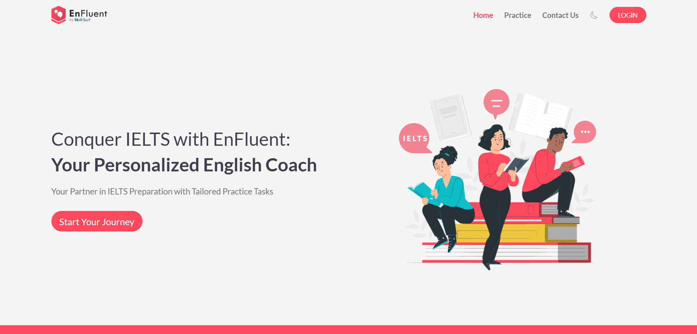

# Enfluent

**Personalize Language Learning through Adaptive Learning Management System**

## Repository Links

- **Automatic Grading App:** [GitHub](https://github.com/kannangaranv/Automatic-grading-ml-app)
- **Student Engagement Detection:** [GitHub](https://github.com/kannangaranv/studentEngagementDetection)
- **Health Sync Connect App:** [GitHub](https://github.com/kannangaranv/HealthSyncConnectApp)
- **Stress Prediction Using Classification models:** [GitHub](https://github.com/kannangaranv/Stress-Prediction-Using-HRV)
- **Health Data Access Server:** [GitHub](https://github.com/kannangaranv/enfluentHealthDataAccessServer)
- **AI Chat Avatar:** [GitHub](https://github.com/kannangaranv/AI_Chat_Avatar_Enfluent)
- **Speech Evaluation:** [GitHub](https://github.com/kannangaranv/speech-evaluation)

---

## 📸 Project Screenshots

### 🏠 Home Page

### 🔐 Sign In Page

### 📚 My Courses

### 🎯 Practice Modules

### 📋 Course Details

### 🤖 Study Buddy Feature

### ✅ Assessment Results

